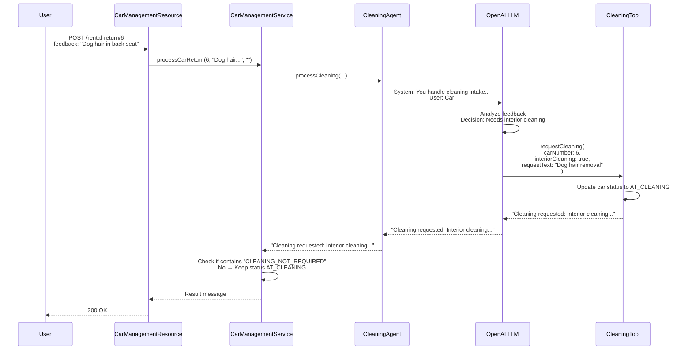
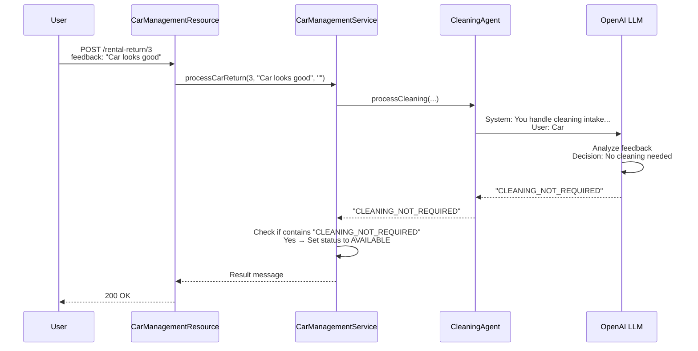

# Step 01 - Implementing AI Agents

## Welcome to Agentic Systems

Welcome to this workshop on **agentic systems** — autonomous AI agents that can work together to solve complex, multi-step problems. You'll build agents that can make decisions, use tools, and collaborate in workflows.

### What You'll Learn

In this workshop, you will:

- Understand the difference between **AI Services** and **AI Agents**
- Build your first autonomous agent using the `quarkus-langchain4j-agentic` module
- Learn how agents use tools (_function calling_) to take actions
- See agents make decisions based on contextual information

---

## A New Scenario: Car Management System

The **Miles of Smiles** car rental company needs help managing their fleet. 
Here's the business process flow:

1. **Rental Returns**: When customers return cars, the rental team records feedback about the car's condition.
2. **Cleaning Requests**: Based on the feedback, the system should automatically decide if the car needs cleaning.
3. **Cleaning Returns**: After cleaning, the team provides their own feedback and returns the car.
4. **Fleet Availability**: Clean cars with no issues return to the available pool for rental.

Your job is to build an **AI agent** that can analyze feedback and _intelligently_ decide whether to request a cleaning.

---

## AI Services vs. AI Agents

Before diving in, let's clarify some key differences:

| Feature         | AI Services                                     | AI Agents                                                                                                                                                                                                                        |
|-----------------|-------------------------------------------------|----------------------------------------------------------------------------------------------------------------------------------------------------------------------------------------------------------------------------------|
| **Purpose**     | Answer user questions                           | Perform autonomous tasks                                                                                                                                                                                                         |
| **Interaction** | Reactive (responds to prompts)                  | Reactive and Proactive (takes actions)                                                                                                                                                                                           |
| **Tool Usage**  | Can call tools when needed                      | Can call tools to accomplish goals                                                                                                                                                                                               |
| **Workflows**   | Single-agent interactions                       | Multi-agent collaboration  ([workflow](https://docs.langchain4j.dev/tutorials/agents/#workflow-patterns){target="_blank"} or [supervisor-based](https://docs.langchain4j.dev/tutorials/agents/#pure-agentic-ai){target="_blank"}) |
| **Annotation**  | Methods use `@SystemMessage` and `@UserMessage` | One method per interface (using `@Agent`)                                                                                                                                                                                        |
| **Use Cases**   | Chatbots, Q&A, content generation               | Automation, decision-making, orchestration                                                                                                                                                                                       |

In this workshop, you'll learn how to build sophisticated, intelligent, and autonomous systems using AI agents.

---

## Prerequisites

Before starting, ensure you have met the [workshop setup requirements](requirements.md){target="_blank"}.

---

## Running the Application

Navigate to the `step-01` directory and start the application:

=== "Linux / macOS"
    ```bash
    cd step-01
    ./mvnw quarkus:dev
    ```

=== "Windows"
    ```cmd
    cd \step-01
    mvnw quarkus:dev
    ```

Once started, open your browser to [http://localhost:8080](http://localhost:8080){target="_blank"}.

### Understanding the UI

The application has two main sections:

1. **Fleet Status** (top): Shows all cars in the Miles of Smiles fleet with their current status.
2. **Returns** (bottom): Displays cars that are currently rented or being cleaned.

{: .center}

---

## Try It Out

Let's see the agent in action!

### Test 1: Car Needs Cleaning

Act as a rental team member processing a car return. In the **Returns > Rental Return** section, select a car and enter this feedback:

```
Car has dog hair all over the back seat
```

Click the **Return** button.

**What happens?**

- The agent analyzes the feedback
- Recognizes the car needs cleaning
- Calls the `CleaningTool` to request interior cleaning
- Updates the car's status to `AT_CLEANING`

Check your terminal logs (you may need to scroll up). You should see output like:

```
🚗 CleaningTool result: Cleaning requested for Mercedes-Benz C-Class (2020), Car #6:
- Interior cleaning
Additional notes: Interior cleaning required due to dog hair in back seat.
```

### Test 2: Car Is Clean

Now try returning a car that's already clean:

```
Car looks good
```

**What happens?**

- The agent analyzes the feedback
- Determines no cleaning is needed
- Returns `CLEANING_NOT_REQUIRED` (no tool call made)
- Updates the car's status to `AVAILABLE`

In your logs, you'll see the agent's response contains:

```
"content":"CLEANING_NOT_REQUIRED"
```

Notice how the agent **made a decision** without calling the cleaning tool. This demonstrates reasoning!

---

## Building Agents with Quarkus LangChain4j

The [langchain4j-agentic](https://docs.langchain4j.dev/tutorials/agents){target="_blank"} module introduces the ability to create AI Agents.
This module is available in Quarkus using the `quarkus-langchain4j-agentic` module.
If you open the `pom.xml` file from the project, you will see this dependency:

```xml
<dependency>
    <groupId>io.quarkiverse.langchain4j</groupId>
    <artifactId>quarkus-langchain4j-agentic</artifactId>
</dependency>
```

### Key Concepts

Agents in LangChain4j:

- Declared as interfaces (implementation generated automatically)
- Use `@SystemMessage` to define the agent's role and behavior
- Use `@UserMessage` to provide request-specific context
- Can be assigned **tools** to perform actions
- Support both programmatic and declarative (annotation-based) definitions, though in Quarkus, we recommend the declarative approach
- **Only one method** per interface can be annotated with `@Agent` - this is the agent entry point
- Designed to be composed with **workflows** or be invoked by a supervisor — agents can be composed together (more on this in [Step 02](step-02.md){target="_blank"})
- Focus on **autonomous actions** rather than conversational responses

---

## Understanding the Application Architecture

{: .center}

The application consists of four main components:

1. **CarManagementResource**: REST API endpoints
2. **CarManagementService**: Business logic and agent orchestration
3. **CleaningAgent**: AI agent that decides if cleaning is needed
4. **CleaningTool**: Tool that requests cleaning services

Let's explore each component.

---

## Component 1: REST API Endpoints

The `CarManagementResource` provides REST APIs to handle car returns:

```java hl_lines="19 22 41 44" title="CarManagementResource.java"
--8<-- "../../step-01/src/main/java/com/carmanagement/resource/CarManagementResource.java:car-management"
```

**Key Points:**

- The `processRentalReturn` method (endpoint `/car-management/rental-return/{carNumber}`):  Accepts feedback from the rental team
- The `processCleaningReturn` method (endpoint `/car-management/cleaningReturn/{carNumber}`): Accepts feedback from the cleaning team
- Both endpoints delegate to `CarManagementService.processCarReturn`

---

## Component 2: Business Logic & Agent Invocation

The `CarManagementService` orchestrates the car return process:

```java hl_lines="1 18-30" title="CarManagementService.java"
--8<-- "../../step-01/src/main/java/com/carmanagement/service/CarManagementService.java:processCarReturn"
```

**Key Points:**

- The `CleaningAgent` field is injected as a CDI bean
- In the `processCarReturn` method, the agent is invoked with car details and feedback. The response is checked for `CLEANING_NOT_REQUIRED`:
    * If found → Car marked as `AVAILABLE`
    * If not found → Car stays `AT_CLEANING` (tool was called)

This simple pattern allows you to ***integrate autonomous decision-making into your business logic***!

---

## Component 3: The CleaningAgent

Here's where the *magic* happens — the AI agent definition:

```java hl_lines="6-11 23-24" title="CleaningAgent.java"
--8<-- "../../step-01/src/main/java/com/carmanagement/agentic/agents/CleaningAgent.java:cleaningAgent"
```

**Let's break it down:**

### `@SystemMessage`
Defines the agent's **role** and **decision-making logic**:

- Acts as the intake specialist for the cleaning department
- Should call the `requestCleaning` function in the `CleaningTool` when cleaning is needed
- Should be specific about which services to request
- Should return `CLEANING_NOT_REQUIRED` if no cleaning is needed

!!! tip "Pro Tip: Clear Instructions Matter"
    The system message is critical! It tells the agent:

    - **WHO** it is (cleaning intake specialist)
    - **WHAT** to do (submit cleaning requests)
    - **WHEN** to act (based on feedback)
    - **HOW** to respond (specific services or `CLEANING_NOT_REQUIRED`)

### `@UserMessage` 
Provides **context** for each request using template variables:

- Car details: `{carMake}`, `{carModel}`, `{carYear}`, `{carNumber}`
- Feedback sources: `{rentalFeedback}`, `{cleaningFeedback}`

These variables are automatically populated from the method parameters.

### `@Agent`
Marks this as an **agent method** — only one per interface.

- Provides a description: "Cleaning specialist. Determines what cleaning services are needed."
- This description can be used by other agents or systems to understand this agent's purpose

### `@ToolBox`
Assigns the `CleaningTool` to this agent:

- The agent can call methods in this tool to perform actions
- The LLM decides when and how to use the tool based on the task

### Method Signature
Defines the inputs and output:

- **Inputs**: All the context the agent needs to make decisions
- **Output**: `String` — the agent's response (either tool result or `CLEANING_NOT_REQUIRED`)

!!! info "No Implementation Required"
    Notice there's **no method body**! LangChain4j automatically generates the implementation:

    1. Receives the inputs
    2. Sends the system + user messages to the LLM
    3. If the LLM wants to call the tool, it does so
    4. Returns the final response

---

## Component 4: The CleaningTool

Tools enable agents to call functions that can take action. These tools can be local, like in the following `CleaningTool` example, or remote (using protocols like MCP - Model Context Protocol).

The concept is similar to function calling in AI services: the LLM decides when to invoke a tool based on the task at hand, and the tool performs the actual action.

```java hl_lines="4 24 42 49-50" title="CleaningTool.java"
--8<-- "../../step-01/src/main/java/com/carmanagement/agentic/tools/CleaningTool.java:CleaningTool"
```

**Key Points:**

- `@Tool` annotation exposes this method to agents
    - The description helps the LLM understand when to use this tool
    - Parameters define what information the agent must provide
- The method updates the car status to `AT_CLEANING`, if the `carInfo` is not `null`
- The method returns a summary of the request (and prints a log messages)
---

## Bonus Component: Liberty MCP CleaningTool

In the main step-01 implementation, the `CleaningTool` is a local LangChain4j tool that runs within the same application on Quarkus. However, tools can also be **remote** services accessed via protocols like **MCP (Model Context Protocol)**.

The **step-01-mcp** variant demonstrates using a remote CleaningTool hosted on a Liberty MCP server. This showcases how agents can seamlessly interact with tools running in different processes or even on different machines.

### What is MCP?

**Model Context Protocol (MCP)** is an open protocol that standardizes how AI applications connect to external data sources and tools. It enables:

- **Remote tool execution**: Tools can run on separate servers
- **Language-agnostic integration**: Tools can be written in any language
- **Standardized communication**: Consistent protocol for tool discovery and invocation

### MCP Implementation Details

The MCP version requires changes in four key areas. Let's examine each:

#### 1. Liberty MCP Server Tool

The CleaningTool on the Liberty server uses Liberty-specific MCP annotations:

```java hl_lines="4 21 23-31" title="CleaningTool.java"
--8<-- "../../step-01-mcp/bonus-liberty-mcp/src/main/java/com/demo/mcp/CleaningTool.java:libertyCleaningTool"
```

**Key Points:**

- The tool is a standard CDI bean (`@ApplicationScoped`)
- Uses `@Tool` from `io.openliberty.mcp.annotations` (not LangChain4j's `@Tool`)
- Each parameter annotated with `@ToolArg` to provide metadata to MCP clients

#### 2. Liberty Server Configuration

The Liberty server must enable the MCP feature:

```xml hl_lines="3" title="server.xml"
-8<- "../../step-01-mcp/bonus-liberty-mcp/src/main/liberty/config/server.xml:mcpFeature"
```

**Key Points:**

- The `mcpServer-1.0` feature enables MCP protocol support
- Tools are automatically discovered and exposed via the MCP endpoint
- The MCP endpoint is available at `/mcp` under the application context root

#### 3. Quarkus Agent with @McpToolBox

The CleaningAgent in the Quarkus application uses `@McpToolBox` instead of `@ToolBox`:

```java hl_lines="25" title="CleaningAgent.java"
--8<-- "../../step-01-mcp/src/main/java/com/carmanagement/agentic/agents/CleaningAgent.java:cleaningAgent"
```

**Key Points:**

- `@McpToolBox` tells Quarkus to discover tools from configured MCP servers
- No need to specify which tools — all tools from the MCP server are available
- The agent code remains otherwise identical to the local tool version

#### 4. MCP Server Configuration

The Quarkus application must be configured to connect to the MCP server:

```properties hl_lines="2-3" title="application.properties"
--8<-- "../../step-01-mcp/src/main/resources/application.properties:mcpConfig"
```

**Key Points:**

- `quarkus.langchain4j.mcp.liberty.transport-type`: Protocol type (streamable-http for Liberty)
- `quarkus.langchain4j.mcp.liberty.url`: Full URL to the MCP endpoint


### Try the MCP Version

Let's see the remote CleaningTool in action:

#### 1. Stop the Current Server

If you have the step-01 Quarkus server running, stop it first (press `Ctrl+C` in the terminal).

#### 2. Start the Liberty MCP Server

Open a **new terminal** and start the Liberty server that hosts the remote CleaningTool:

=== "Linux / macOS"
    ```bash
    cd step-01-mcp/bonus-liberty-mcp
    mvn liberty:run
    ```

=== "Windows"
    ```cmd
    cd step-01-mcp\bonus-liberty-mcp
    mvn liberty:run
    ```

Wait for the Liberty server to start. You should see:

```
[INFO] [AUDIT   ] CWWKF0011I: The defaultServer server is ready to run a smarter planet.
```

#### 3. Start the Quarkus Application

In your original terminal, start the Quarkus application:

=== "Linux / macOS"
    ```bash
    cd ../step-01-mcp
    ./mvnw quarkus:dev
    ```

=== "Windows"
    ```cmd
    cd ..\step-01-mcp
    mvnw quarkus:dev
    ```

#### 4. Test the Remote Tool

Open your browser to [http://localhost:8080](http://localhost:8080){target="_blank"} and try the same test as before:

**Test: Car Needs Cleaning**

In the **Returns > Rental Return** section, select a car and enter:

```
Car has dog hair all over the back seat
```

Click **Return**.

**What's different?**

- The agent still analyzes the feedback
- But now it calls the **remote** CleaningTool on the Liberty server
- The tool executes on Liberty and returns the result
- The agent receives the response and updates the car status

Check both terminal windows:

- **Liberty terminal**: You'll see the MCP tool being invoked
- **Quarkus terminal**: You'll see the agent making the remote call

### Key Differences: Local vs. Remote Tools

| Aspect | Local Tool (step-01) | Remote Tool (step-01-mcp) |
|--------|---------------------|---------------------------|
| **Location** | Runs in same Quarkus process | Runs on separate Liberty server |
| **Annotation** | `@ToolBox(CleaningTool.class)` | `@McpToolBox` |
| **Configuration** | None needed | MCP server URL in `application.properties` |
| **Use Case** | Simple, single-app scenarios | Distributed systems, shared tools |

### When to Use Remote Tools?

Consider remote tools when:

- **Sharing tools** across multiple applications
- **Isolating concerns**: Tool logic separate from agent logic
- **Language diversity**: Tools written in different languages
- **Scalability**: Tools need independent scaling
- **Legacy integration**: Connecting to existing services

#### 5. Clean Up

When you're done experimenting:

1. Stop the Liberty server (press `Ctrl+C` in the Liberty terminal)
2. Close the Liberty terminal
3. Stop the Quarkus server (press `Ctrl+C` in the Quarkus terminal)
4. In the Quarkus terminal, return to `step-01` directory and start the app:

=== "Linux / macOS"
    ```bash
    cd ../step-01
    ./mvnw quarkus:dev
    ```

=== "Windows"
    ```cmd
    cd ..\step-01
    mvnw quarkus:dev
    ```

### Understanding Tool Execution Flow

Here is the sequence of actions happening when the agent is invoked:

1. Agent receives car return feedback (entered by the user)
2. LLM analyzes the feedback
3. LLM decides to call `requestCleaning` (or not, depending on the feedback)
4. If called, LLM determines which parameters to use:
     - Should `interiorCleaning` be true?
     - Should `exteriorWash` be true?
     - What `requestText` should be included?
5. Tool executes and returns a result
6. Agent receives the result and can respond

## How It All Works Together

Let's trace through a complete example:

### Scenario: Dog Hair in Back Seat



### Scenario: Car Looks Good



---

## Key Takeaways

- **Agents are autonomous**: They make decisions and take actions based on context.
- **Tools enable actions**: Agents use tools to interact with systems (databases, APIs, etc.)
- **Clear prompts matter**: The `@SystemMessage` guides the agent's decision-making
- **Type-safe interfaces**: No manual API calls — just define interfaces and let Quarkus LangChain4j handle the rest
- **CDI integration**: Agents and tools are managed beans that integrate seamlessly with Quarkus

---

## Experiment Further

Try these experiments to deepen your understanding:

### 1. Test Edge Cases

Try different feedback scenarios:

```
The trunk smells like fish
```

```
Minor scratch on the bumper
```

```
Spotless condition
```

What does the agent decide for each? Does it call the cleaning tool?

### 2. Modify the System Message

Edit `CleaningAgent.java` and change the system message. For example:

```java
@SystemMessage("""
    You are a very picky cleaning intake specialist.
    Request a full detail (exterior, interior, waxing, detailing)
    unless the car is absolutely perfect.
    If perfect, respond with "CLEANING_NOT_REQUIRED".
    """)
```

How does this change the agent's behavior?

### 3. Add More Tool Parameters

Edit `CleaningTool.java` to add a `tireCleaning` parameter. 
Does the agent automatically learn to use it?

---

## Troubleshooting

??? warning "Error: OPENAI_API_KEY not set"
    Make sure you've exported the environment variable:

    ```bash
    export OPENAI_API_KEY=sk-your-key-here
    ```

    Then restart the application.

??? warning "Tool methods not being called"
   - Verify the tool uses `@Dependent` scope
   - Check that the `@Tool` annotation is present
   - Ensure the tool is properly referenced in `@ToolBox`

??? warning "Agent always/never calls the tool"
   - Review your `@SystemMessage` — is it clear about when to use the tool?
   - Try adding more explicit instructions
   - Consider providing examples in the system message

---

## Cleanup

Before moving to the next step, let's clean up:

1. **Stop the running server** by pressing `Ctrl+C` in the terminal where Quarkus is running

2. **Return to the root project directory**:

    ```bash
    cd ..
    ```
    
---

## What's Next?

In this step, you built a **single autonomous agent** that makes decisions and uses tools.

In **Step 02**, you'll learn how to compose **multiple agents into workflows** — where agents collaborate to solve complex problems together!

[Continue to Step 02 - Composing Simple Agentic Workflows](step-02.md)