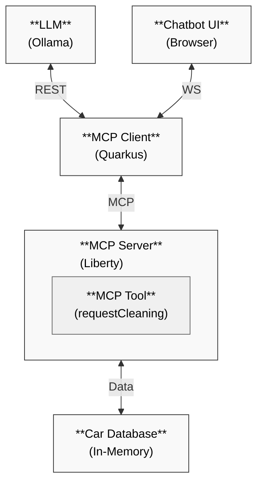

# Liberty MCP Server

This project provides an Open Liberty-based MCP (Model Context Protocol) server that exposes car cleaning tools to MCP clients. The server acts as a bridge between AI applications and business logic/data.

## Technical Overview

The application uses:
- **Open Liberty**: A lightweight, open-source Java runtime
- **MicroProfile**: For REST client and configuration
- **MCP Server Feature**: Liberty's implementation of the MCP protocol

## Key Components

- `CleaningTool`: Implements the MCP tool for car cleaning requests using the `@Tool` annotation
- `server.xml`: Liberty server configuration with MCP feature enabled

## Prerequisites

- [Java 17+](https://developer.ibm.com/languages/java/semeru-runtimes/downloads/)
- [Ollama](https://ollama.com/download/) or [OpenAI API Key](https://platform.openai.com/account/api-keys) or [Anthropic API Key](https://docs.claude.com/en/docs/get-started)
- (Optional) Maven 3.8.1+ 
  - Alternatively use the provided Maven wrapper via `./mvnw` or `mvnw.cmd`

## Server Configuration

The Liberty server is configured in `server.xml`:

```xml
<featureManager>
    <feature>microProfile-7.0</feature>
    <feature>mcpServer-1.0</feature>
</featureManager>

<httpEndpoint id="defaultHttpEndpoint"
              httpPort="9080"
              httpsPort="9443" />

<webApplication contextRoot="/mcp-liberty-server" location="mcp-liberty-server.war" />
```

## MCP Tool Implementation

The server exposes a car cleaning request tool using the MCP protocol:

```java
@Tool(name = "requestCleaning", description = "Requests a cleaning with the specified options for a car")
public String requestCleaning(
        @ToolArg(name = "carNumber", description = "The car number") int carNumber,
        @ToolArg(name = "carMake", description = "The car make") String carMake,
        @ToolArg(name = "carModel", description = "The car model") String carModel,
        @ToolArg(name = "carYear", description = "The car year") int carYear,
        @ToolArg(name = "exteriorWash", description = "Whether to request exterior wash") boolean exteriorWash,
        @ToolArg(name = "interiorCleaning", description = "Whether to request interior cleaning") boolean interiorCleaning,
        @ToolArg(name = "detailing", description = "Whether to request detailing") boolean detailing,
        @ToolArg(name = "waxing", description = "Whether to request waxing") boolean waxing,
        @ToolArg(name = "requestText", description = "Additional cleaning request notes") String requestText) {
    // Implementation generates cleaning request summary
}
```

## Running the Server

1. Build and run the Liberty server:
   ```bash
   ./mvnw liberty:dev
   ```

The Liberty server will start on port 9080.

### 3. Access the Application

1. Open http://localhost:8080/ in your browser
2. Click the chat icon in the bottom right corner to start a conversation
3. Ask car cleaning-related questions like:
   - Car has dog hair all over the back seat
   - Car looks good
   - The trunk smells like fish

## How It Works

1. The user sends a car cleaning request to the Quarkus client
2. The client uses an LLM (via Ollama, OpenAI or Anthropic) to process the query
3. The LLM determines the cleaning parameters and calls the MCP tool
4. The Liberty server receives the tool request and processes the cleaning request
5. The cleaning request summary is returned to the MCP client
6. The LLM formats the response and presents it to the user

## Project Structure

- `step-01-mcp/`: Quarkus MCP client with car management application and AI chatbot interface
- `step-01-mcp/bonus-liberty-mcp/`: Liberty MCP server providing the car cleaning tool

See the README files in each directory for more details about the specific components.
## Architecture
